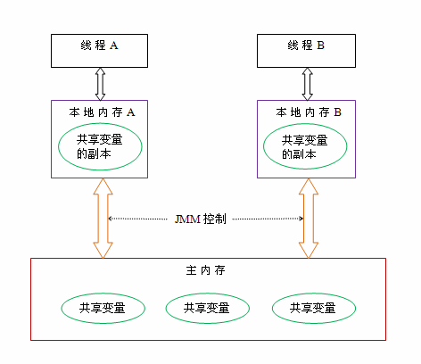
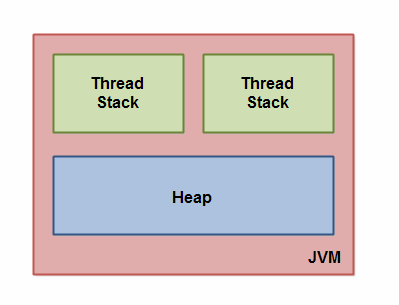
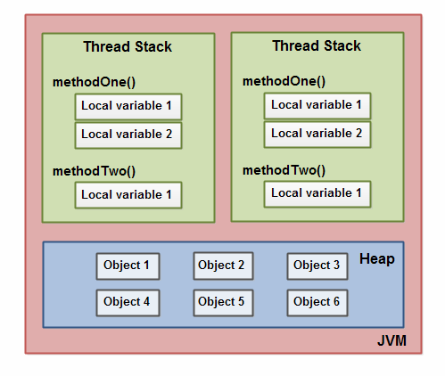
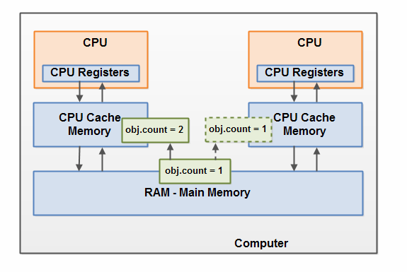
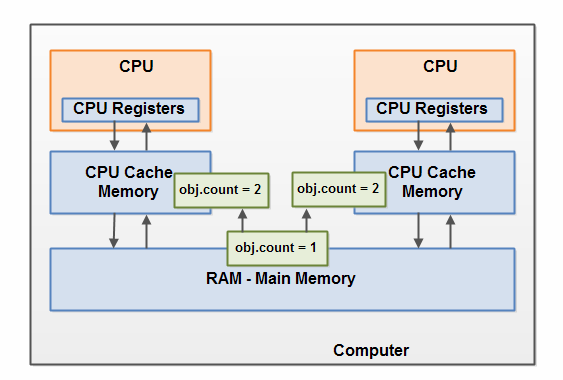

#### Jvm常见参数

```tex
//常见配置汇总 
//堆设置 
-Xms:初始堆大小 
-Xmx:最大堆大小 
-xss:设置栈容量
-XX:NewSize=n:设置年轻代大小 
-XX:NewRatio=n:设置年轻代和年老代的比值.如:为3,表示年轻代与年老代比值为1:3,年轻代占整个年轻代年老代和的1/4 
-XX:SurvivorRatio=n:年轻代中Eden区与两个Survivor区的比值.注意Survivor区有两个.如:3,表示Eden:Survivor=3:2,一个Survivor区占整个年轻代的1/5 
-XX:MaxPermSize=n:设置持久代大小
//收集器设置 
-XX:+UseSerialGC:设置串行收集器 
-XX:+UseParallelGC:设置并行收集器 
-XX:+UseParalledlOldGC:设置并行年老代收集器 
-XX:+UseConcMarkSweepGC:设置并发收集器
//垃圾回收统计信息 
-XX:+PrintGC 
-XX:+PrintGCDetails 
-XX:+PrintGCTimeStamps 
-Xloggc:filename
//并行收集器设置 
-XX:ParallelGCThreads=n:设置并行收集器收集时使用的CPU数.并行收集//线程数. 
-XX:MaxGCPauseMillis=n:设置并行收集最大暂停时间 
-XX:GCTimeRatio=n:设置垃圾回收时间占程序运行时间的百分比.公式为1/(1+n)
//并发收集器设置 
-XX:+CMSIncrementalMode:设置为增量模式.适用于单CPU情况. 
-XX:ParallelGCThreads=n:设置并发收集器年轻代收集方式为并行收集时,使用的CPU数.并行收集线程数.
```

#### Volatile和Synchronized关键字

线程安全的两个方面：**执行控制**和**内存可见**  
**执行控制：** 目的是控制代码执行（顺序）及是否可以并发执行  
**内存可见：** 控制线程执行结果在内存中对其他线程的可见性 

##### Synchronized

`synchronized`关键字解决的是执行控制的问题。

> 它会阻止其它线程获取当前对象的监控锁，就使得当前对象中被`synchronized`关键字保护的代码块无法被其它线程访问，也就无法并发执行。更重要的是，`synchronized`还会创建一个**内存屏障**，内存屏障指令保证了所有CPU操作结果都会直接刷到主存中，从而保证了操作的内存可见性，同时也使得先获得这个锁的线程的所有操作，都**happens-before**于随后获得这个锁的线程的操作。 

##### Volatile

`volatile`关键字解决的是内存可见性的问题。

> 会使得所有对`volatile`变量的读写都会直接刷到主存，即保证了变量的可见性。这样就能满足一些对变量可见性有要求而对读取顺序没有要求的需求。 

volatile关键字仅仅能实现对基本类型变量操作的原子性，不能保证复合操作的原子性。  
当且仅当满足下面条件才可使用： 

1. 对变量的写入操作不依赖变量的当前值，或者你能确保只有单个线程更新变量的值。
2. 该变量没有包含在具有其他变量的不变式中。 

##### Volatile和Synchronized的区别

1. volatile本质是告诉jvm当前变量在寄存器中（本地内存）的值是不确定的，需要从主存中读取数据，  
   synchronized 是锁定当前变量，只有当前线程可以访问该变量，其他线程被阻塞
2. volatile 使用在变量级，  
   synchronized可以使用在变量、方法和类级别。
3. volatile仅能保证变量的修改可见性，不能保证原子性，  
   synchronized可以保证修改可见性和原子性
4. synchronized会造成线程阻塞，volatile则不会 
5. volatile标记的变量不会被编译器优化，synchronize标记的变量可以被优化


#### Java内存模型

Java内存模型（Java Memory Model,简称JMM）。定义了Java虚拟机（JVM）在计算机内存（RAM）中的工作方式。定义了多线程之间共享变量可见性以及如何在需要的时候对共享变量进行同步。
#### 关于并发编程
并发中两个关键问题：通信和同步。  
1、线程的通信：线程之间以何种机制来交换信息。命令式编程中，有共享内存和消息传递两种方式  
&emsp;&emsp;共享内存：线程之间共享线程的公共状态，线程通过读-写内存中的公共状态来隐式进行通信，典型通信方式：共享对象  
&emsp;&emsp;消息传递：消息之间没有公共状态，线程之间通过明确的发送消息来显式进行通信，java典型的消息传递方式就是wait()和notify()

2、线程同步：程序用于控制不同线程之间操作发生顺序  
&emsp;&emsp;共享内存的并发模式中，同步是显式的。程序员必须显式的指定某个方法或代码需要在线程之间互斥执行
&emsp;&emsp;消息传递并发模式中，消息的发送必须在消息接收之前，通信是隐式的

**Java的采用共享内存的方式实现线程同步**

JMM决定一个线程对共享变量的写入何时对另一个线程可见，定义了线程和主存之间的抽象关系：线程之间的共享变量存储在主内存(Main memory)中，每个线程都有一个私有的本地内存（Local memory),本地内存中存储了该线程以读/写共享变量的副本。  
注：本地内存是JMM的一个抽象概念，并不真实存在  
  
线程A与线程B如果想要通信的话，需要：

> 1.线程A把本地内存A中更新过的共享变量刷新到主内存中去 
> 2.线程B到主内存中去读取线程A更新过的共享变量

#### JVM对Java内存模型的实现

java内存模型内部把内存分成两部分：`线程栈区`和`堆区`  


> JVM中运行的每个线程都拥有自己的线程栈，线程栈包含了当前线程执行的方法调用相关信息，称为调用栈。随着代码的不断执行，调用栈会不断变化。 

> 线程栈包含了当前方法的所有本地变量信息。
> 一个线程只能读取自己的线程栈，线程中的本地变量对其它线程是不可见的。即使两个线程执行的是同一段代码，它们会各自在自己的线程栈中创建本地变量，因此，每个线程中的本地变量都会有自己的版本。 

> 原始类型（byte、boolean、char、short、int、long、float、double）的本地变量都直接保存在线程栈中，每个线程中这些值都是相互独立不可见的。当他们无法共享时，一个线程可以传递一个副本给另一个线程。

> 堆区（Heap）存放Java应用创建的所有对象信息。不管对象是哪个线程创建或者对象属于一个成员变量还是方法中的本地变量，都被存储在堆区

        

**本地变量存储位置：** 

> 原始类型：栈区
> 对一个对象的引用：本地引用存储在栈区，对象本身存在在堆区

**对象的存储位置：** 

> 成员方法：方法中包含了本地变量，所以存储在栈区
> 成员变量：不管是包装类型还是基本类型，都存放在堆区

**Static类型的变量和类本身的相关信息随类本身存储在堆区** 

> 注：对象存储在堆区可以本多个线程共享，多个线程获得对象之后，则获得对象的成员变量，但对于本地变量，每个线程都会拷贝一份到自己的线程中。

#### 共享对象的可见性

多个线程同时操作同一个共享对象时，如果没有合理的使用volatile和synchronization关键字，一个线程对共享对象的更新有可能导致其它线程不可见 。  


CPU一个线程读取主存中的数据到CPU缓存，对于共享对象进行了更改，对于其他CPU线程是不可见的。
使用volatile 关键字：可以保证变量会直接从主存读取，而对变量的更新会直接写到主存中，对所有线程可见。
原理：基于CPU的内存屏障指令实现

#### 竞争现象

多个线程共享一个对象，同时修改这个共享对象，就出现竞争现象。  


解决方法：使用synchronized代码块。可以保证同一时刻只能有一个线程进入代码竞争区，synchronized代码块保证代码块中所有变量都会从主存中读，当线程退出代码块时，对所有变量的更新将会flush到主存，不管这些变量是不是volatile类型的。

####  Java内存模型的基础原理

**指令重排序**   
是在执行程序时，为了提高性能，编译器和处理器会对指令做重排序。但是，JMM确保在不同的编译器和不同的处理器平台之上，通过插入特定类型的`Memory Barrier`来禁止特定类型的编译器重排序和处理器重排序，为上层提供一致的内存可见性保证。 

1. 编译器优化重排序：编译器在不改变单线程程序语义的前提下，可以重新安排语句的执行顺序。
2. 指令级并行的重排序：如果不存l在数据依赖性，处理器可以改变语句对应机器指令的执行顺序。
3. 内存系统的重排序：处理器使用缓存和读写缓冲区，这使得加载和存储操作看上去可能是在乱序执行。

**数据依赖性**   
如果两个操作访问同一个变量，其中一个为写操作，此时这两个操作之间存在数据依赖性。编译器和处理器不会改变存在数据依赖性关系的两个操作的执行顺序，即不会重排序。

**as-if-serial**  
不管怎么重排序，单线程下的执行结果不能被改变，编译器、runtime和处理器都必须遵守as-if-serial语义。

**内存屏障（Memory Barrier）**  
内存屏障，又称内存栅栏，是一个CPU指令：

> 1.保证特定操作的执行顺序。
> 2.影响某些数据（或者是某条指令的执行结果）的内存可见性。

内存屏障告诉编译器和CPU：不管什么指令都不能和这条Memory Barrier指令重排序。  
Memory Barrier所做的另外一件事是强制刷出各种CPU cache，如一个`Write-Barrier`（写入屏障）将刷出所有在Barrier之前写入 cache 的数据，因此，任何CPU上的线程都能读取到这些数据的最新版本。  
java内存模型中的volatile是基于`内存屏障`实现的。  
如果一个变量是`volatile`修饰的，JMM会在写入这个字段之后插进一个`Write-Barrier`指令，并在读这个字段之前插入一个`Read-Barrier`指令。这意味着，如果写入一个`volatile`变量，就可以保证：

1. 一个线程写入变量a后，任何线程访问该变量都会拿到最新值。
2. 在写入变量a之前的写入操作，其更新的数据对于其他线程也是可见的。因为Memory Barrier会刷出cache中的所有先前的写入。

#### happens-before

在JMM中，如果一个操作的执行结果需要对另一个操作可见，那么这两个操作之间必须存在happens-before关系
这两个操作可以是在同一个线程中，也可以在不同的线程中
happens-before规则：

1. 程序顺序规则：一个线程中的每个操作，happens-before于该线程中任意的后续操作。
2. 监视器锁规则：对一个锁的解锁操作，happens-before于随后对这个锁的加锁操作。
3. volatile域规则：对一个volatile域的写操作，happens-before于任意线程后续对这个volatile域的读。
4. 传递性规则：如果 A happens-before B，且 B happens-before C，那么A happens-before C。

注：两个操作之间具有happens-before关系，并不意味着前一个操作必须在后一个操作之前执行！仅仅要求前一个操作的执行结果对后一个操作是可见的，且前一个操作按顺序排在后一个操作之前。 

#### 自动内存管理机制


##### 运行时数据区域


> 注：
> 线程私有：程序计数器、虚拟机栈、本地方法栈
> 线程共享：方法区和堆

###### 程序计数器

**作用：** 当前线程所执行的字节码的行号指示器

- 字节码解释器工作时通过改变它的值来选取下一条需要执行的字节码指令
- 分支、循环、跳转、异常处理和线程恢复都依赖他

###### 虚拟机栈

**作用：** 用于存储局部变量表、操作数栈、动态链接和方法出口等信息
`局部变量表`用于存放8种基本数据类型（boolean,byte,char,short,int,long,float,double）和reference类型
`reference类型`

- 指向对象起始地址的引用指针
- 指向一个代表对象的句柄
- 指向一个字节码指令的地址

可抛出两种异常状况

- 线程请求的栈深度大于虚拟机所允许的栈深度，抛出StackOverflowError异常
- 当扩展时无法申请到足够的内存时会抛出OutofMemoryError异常

###### 本地方法栈

与虚拟机栈的作用非常相似.其区别是虚拟机栈执行Java方法服务,而本地方法栈则为虚拟机使用到的Native方法服务会抛出StackOverflowError和OutOfMemoryError异常

###### 堆

作用：分配所有的对象实例和数组。可以抛出OutofMenoryError异常

###### 方法区

作用：用于存储已被虚拟机加载的类信息(Class)、常量(final修饰)、静态变量(static)和即时编译器编译后的代码(code) 
可以抛出OutofMemoryError异常

###### 运行时常量池

属于方法区的一部分
作用：用于存放编译期生成的各种字面量和符号引用，在类加载后存放到方法区的运行时常量池中。
可以抛出OutofMemoryError异常

##### 对象访问

访问方式：使用句柄和直接指针
优缺点：


##### OutofMemoryError异常

java虚拟机中，除了程序计数器外，虚拟机内存中其他几个运行时区域都会发生。
具体：

- Java 堆溢出
- 虚拟机栈和本地方法栈溢出
- 方法区溢出
- 运行时常量池溢出
- 本机直接内存溢出

#### 内存溢出（OutofMemory）

定义：是指程序在申请内存时，没有足够的内存空间供其使用。

#### 内存泄露（Memory Leak）

定义：是指程序在申请内存之后，无法释放已申请的内存空间，最终会导致OutofMemory
内存泄露，向系统申请分配内存进行使用（new）,可是使用完了以后却不归还（delete）,结果自己申请的那块内存自己也不能访问，系统也不能再次把它分配给需要的程序。
内存泄漏可以分为4类： 

1. 常发性内存泄漏。发生内存泄漏的代码会被多次执行到，每次被执行的时候都会导致一块内存泄漏。
2. 偶发性内存泄漏。发生内存泄漏的代码只有在某些特定环境或操作过程下才会发生。常发性和偶发性是相对的。对于特定的环境，偶发性的也许就变成了常发性的。所以测试环境和测试方法对检测内存泄漏至关重要。
3. 一次性内存泄漏。发生内存泄漏的代码只会被执行一次，或者由于算法上的缺陷，导致总会有一块仅且一块内存发生泄漏。比如，在类的构造函数中分配内存，在析构函数中却没有释放该内存，所以内存泄漏只会发生一次。
4. 隐式内存泄漏。程序在运行过程中不停的分配内存，但是直到结束的时候才释放内存。严格的说这里并没有发生内存泄漏，因为最终程序释放了所有申请的内存。但是对于一个服务器程序，需要运行几天，几周甚至几个月，不及时释放内存也可能导致最终耗尽系统的所有内存。所以，我们称这类内存泄漏为隐式内存泄漏。

内存泄露对于用户使用程序来说，并不会产生危害。问题在于内存泄露的堆积，最终会耗尽所有内存。