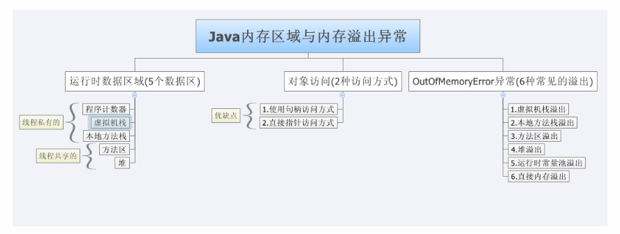
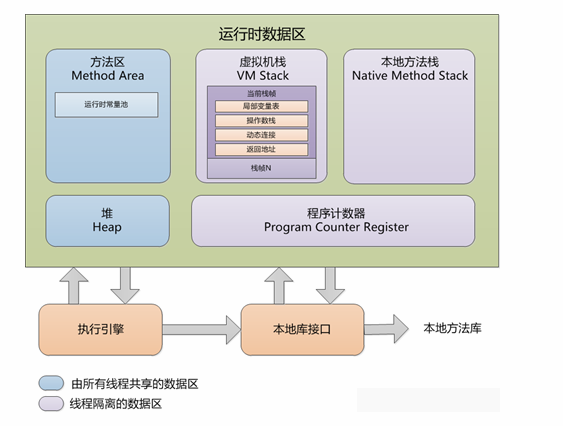
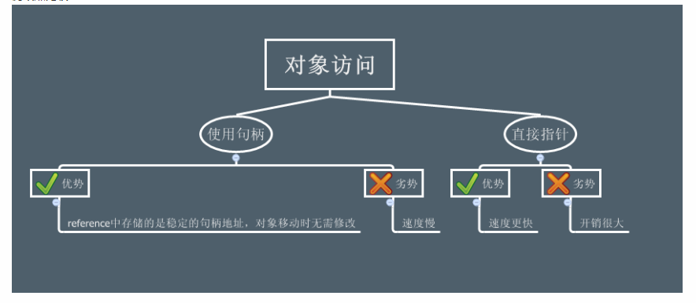

## 自动内存管理机制

## 运行时数据区域

> 注：
> 线程私有：程序计数器、虚拟机栈、本地方法栈
> 线程共享：方法区和堆

### 程序计数器

**作用：**当前线程所执行的字节码的行号指示器

* 字节码解释器工作时通过改变它的值来选取下一条需要执行的字节码指令
* 分支、循环、跳转、异常处理和线程恢复都依赖他

### 虚拟机栈

**作用：**用于存储局部变量表、操作数栈、动态链接和方法出口等信息
`局部变量表`用于存放8种基本数据类型（boolean,byte,char,short,int,long,float,double）和reference类型
`reference类型`

- 指向对象起始地址的引用指针
- 指向一个代表对象的句柄
- 指向一个字节码指令的地址

可抛出两种异常状况

- 线程请求的栈深度大于虚拟机所允许的栈深度，抛出StackOverflowError异常
- 当扩展时无法申请到足够的内存时会抛出OutofMemoryError异常

### 本地方法栈

与虚拟机栈的作用非常相似.其区别是虚拟机栈执行Java方法服务,而本地方法栈则为虚拟机使用到的Native方法服务
会抛出StackOverflowError和OutOfMemoryError异常

### 堆

作用：分配所有的对象实例和数组。可以抛出OutofMenoryError异常

### 方法区

作用：用于存储已被虚拟机加载的类信息(Class)、常量(final修饰)、静态变量(static)和即时编译器编译后的代码(code) 
可以抛出OutofMemoryError异常

### 运行时常量池

属于方法区的一部分
作用：用于存放编译期生成的各种字面量和符号引用，在类加载后存放到方法区的运行时常量池中。
可以抛出OutofMemoryError异常

## 对象访问

访问方式：使用句柄和直接指针
优缺点：

## OutofMemoryError异常

java虚拟机中，除了程序计数器外，虚拟机内存中其他几个运行时区域都会发生。
具体：

- Java 堆溢出
- 虚拟机栈和本地方法栈溢出
- 方法区溢出
- 运行时常量池溢出
- 本机直接内存溢出