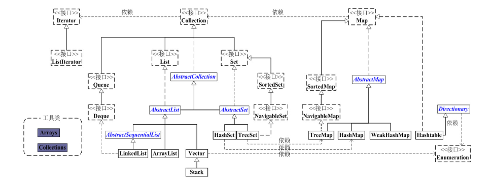

#### 面向对象和面向过程

**面向对象** ：站在现实世界的角度去抽象和解决问题，把数据和行为都看做为对象的一部分，让程序员能够以符合现实世界的思维方式来编写和组织程序  
**面向过程** ：数据代表问题空间中的客体，程序代码用于处理这些数据，这种思维是直接站在计算机的角度去抽象和解决问题，把这种编程思想称为面向过程的思想

#### 接口和抽象类

##### 接口

定义：接口在java中是一个抽象类型，是抽象方法的集合。一个类通过继承接口的方式，从而继承接口的抽象方法。  
解释：  
接口是个抽象方法的集合，不是一个类，不能被实例化。  
接口中没有构造方法  
除了static、final变量之外，不能有其他变量  
支持多继承  
方法必须是抽象的，不用abstract修饰，只声明，不实现。

##### 抽象类

定义：如果一个类没有包含足够多的信息来描述一个具体的对象，这样的类就是抽象类。   
解释：是一个类，被abstract修饰，拥有成员变量，成员方法，构造方法。但不能被实例化，因为没有包含足够的信息类描述一个具体的对象，即成员方法没有具体实现，只拥有抽象方法（被abstract修饰）：只声明，不实现。

##### 区别

- 抽象类可以有默认的方法实现也可以完全是抽象的，接口不存在方法的实现。
- 子类通过extends关键字来继承抽象类，子类若不是抽象类，则需要实现抽象类所有声明的方法
  子类通过implements关键字来实现接口，需要实现接口中所有声明的方法的实现
- 抽象类可以有构造器，接口不行
- 抽象方法可以有public、protected、default修饰符
  接口方法默认修饰符只有public,不能有其他修饰符
- 抽象类在java中表示一种继承关系，一个子类只存在一个父类，但是可实现多个接口
- 抽象方法比接口速度快
  因为接口需要时间去寻找在类中的实现方法
- 如果向抽象类中添加方法，可以提供默认的实现，不需要改变现在的代码
  如果向接口中添加方法，那必须改变实现该接口的类

#### Java多态的理解

定义：程序所定义的引用变量所指向的具体类型和通过该引用变量发出的方法调用在编程时并不确定，而是在程序运行期间才能确定。  
指允许不同类的对象对同一消息做出响应。即同一消息可以根据发送对象的不同而采用多种不同的行为方式。  
**多态三个必要条件：** 继承、重写、父类引用指向子类对象  
**继承：** 在多态中必须存在有继承关系的子类和父类  
**重写：** 子类对父类的某些方法重新定义，在调用的时候就会使用子类中重新定义的方法  
**父类引用指向子类对象：** 在多态中需要将子类的引用赋值给父类对象，只有这样改引用才能具有同时调用父类和子类方法的技能
**实现多态的技术：** 动态绑定，在执行阶段判断所引用对象的实际类型，根据其实际类型调用其相应的方法
作业：消除类型之间的耦合关系

#### 反射

定义:在程序运行时，对于任意的类，都能够知道这个类的所有属性方法；对于任意的一个对象，都能够通过反射机制调用一个类的任意方法，这种动态获取类的信息和动态调用类的对象方法的功能成为Java的反射机制
作用：

- 动态的创建类的实例，将类绑定到先有的对象中，或从现有的对象中获取类型
- 应用程序需要在运行时从某个特定的程序集合中载入一个特定的类

#### Java中Object常用方法

1. clone()
2. equals()
3. finalize()
4. getClass()
5. hasCode()
6. notify()
7. notifyAll()
8. toString()

#### String

String：字符串常量，字符串长度不可变。Java中String是immutable(不可变)的。
String类包含了：

```java
private final char value[];
private final int offset;
private final int count;
```

用于存放字符的数组被声明为final的，因此只能赋值一次，不可再更改。

##### StringBuffer

字符串变量（Synchronized，线程安全），适合频繁对字符串内容进行修改的操作。Java.lang.StringBuffer是线程安全的可变字符序列。在任意时间点上它包含某种特定的字符序列，可将字符串缓冲区安全地用于多线程。
StringBuffer的主要操作是append和insert，append方法始终将需要添加的字符添加到缓冲区的末端，insert的方法在指定的位置添加字符。

##### StringBuilder

字符串变量（非线程安全），在内部，StringBuilder对象被当做是一个包含字符序列的变长数组
`java.lang.StringBuilde`提供了一个与StringBuilder兼容的API，但不保证同步。被设计为StringBuilder的一个简易替换，用在字符串缓存区被单个线程使用的时候。不考虑线程的安全性。

##### 三者区别

String：每次对`String`类型进行改变的时候，都会生成一个新的`String`对象，然后将指针指向新的`Stirng`对象。
Stirng对象的字符串拼接其实被Java Compiler编译成了StringBuffer对象的拼接，所以速度和StringBuffer处理字符拼接的速度相近。但如果拼接的字符串来自另外的String对象，`Java Compiler`就不会自动转换了。
StringBuffer：每次操作都是对其本身进行的操作，不生成新的对象并改变对象引用。
StringBuilder：单线程，非线程安全的

##### 使用策略

1. 对于操作少量的数据，用`String`,单线程操作大量数据，用`StringBuffer`,多线程操作大量数据，用`StringBuilder`。
2. StringBuilder一般使用在方法内部来完成类似`+`的功能，因为线程不安全，所以用完以后可以丢弃。StringBuffer主要用在全局变量中。
3. 除非确定系统的瓶颈是在StringBufffer上，并且确定模块不会运行在多线程模式下，才可以采用StringBuilder，否在使用StringBuffer。

#### Java异常

##### Java异常


###### Throwable

有两个重要的子类：Exception(异常)和Error(错误)

###### Error(错误)

是程序无法处理的错误，表示运行应用程序中较严重问题。大多数错误与代码编写者执行的操作无关，而表示代码运行时 JVM（Java 虚拟机）出现的问题。eg:JVM错误

###### Exception(异常)

是程序本身可以处理的异常。
Exception 类有一个重要的子类 RuntimeException。RuntimeException 类及其子类表示“JVM 常用操作”引发的错误。 如：NullPointerException、ArithmeticException、ArrayIndexOutOfBoundException  
**注：异常和错误的区别：异常能被程序本身处理，错误是无法处理的** 

###### 运行时异常

都是RuntimeException类及其子类。如NullPointerException(空指针异常)、IndexOutOfBoundsException(下标越界异常)等，这些异常是不检查异常，程序中可以选择捕获处理，也可以不处理 
运行时异常的特点是Java编译器不会检查它，也就是说，当程序中可能出现这类异常，即使没有用try-catch语句捕获它，也没有用throws子句声明抛出它，也会编译通过。 

###### 非运行时异常

是RuntimeException以外的异常，类型上都属于Exception类及其子类。从程序语法角度讲是必须进行处理的异常，如果不处理，程序就不能编译通过。如IOException、SQLException等以及用户自定义的Exception异常，一般情况下不自定义检查异常 

##### 可检查异常**（checked exceptions）**  

定义：编译器要求必须处置的异常
除了RuntimeException及其子类以外，其他的Exception类及其子类都属于可查异常。这种异常的特点是Java编译器会检查它，也就是说，当程序中可能出现这类异常，要么用try-catch语句捕获它，要么用throws子句声明抛出它，否则编译不会通过 

##### 不可检查异常**（unchecked exceptions）**  

定义：编译器不要求强制处理的异常
包括运行时异常（RuntimeException与其子类）和错误（Error）

##### 异常处理机制

###### 抛出异常

当方法出现错误引发异常时，方法创建异常对象并交付运行时的系统，异常对象包含了异常类型和异常出现时的程序状态等异常信息。运行时系统负责寻找处置异常的代码并执行。

###### 捕获异常

方法抛出异常后，运行时系统将寻找合适的异常处理器。潜在异常处理器是异常发生时依次留存在调用栈中的方法集合。从异常方法开始，寻找调用栈中的异常处理器，找到则执行;未找到，则程序终止。  
**对于运行时异常、错误或可查异常，Java技术所要求的异常处理方式有所不同**

- 运行时异常：有Java运行时系统自动抛出，允许程序忽略运行时异常
- 错误：当运行时方法不行捕获时，系统允许忽略
- 可检查异常：方法必须捕获，或者声明使其抛出方法之外。意味着，当一个方法选择不捕获可查异常时，必须声明将抛出异常。

###### 捕获方法

- try-catch语句
- try-catch-finally
  finally块：无论是否捕获异常，finally块中的语句都会被执行，当在try或者catch块中有return时，finally块在方法返回之前执行。
  finally块不执行的特殊情况：
  1. 在finally块中发生了异常
  2. 在前面的代码中使用了System.exit()方法退出程序
  3. 程序所在的线程死亡
  4. 关闭CPU

###### 抛出异常

1. throws异常
   如果一个方法可能会出现异常，但没有能力处理这种异常，可以在方法声明处用throws子句来声明抛出异常。

   ```java
   methodname throws Exception1,Exception2,Exception3,...,ExceptionN{
       
   }
   ```

2. Throws抛出异常的规则

   - 如果是不可查异常（unchecked exception），即Error、RuntimeException或它们的子类，可以不使用throws关键字来声明要抛出的异常，编译仍能顺利通过，在运行时会被系统抛出。 
   - 必须声明方法的可抛出的任何可查异常（checked exception）。即如果一个方法可能出现可查异常，要么用try-catch语句捕获，要么用throws子句声明将它抛出，否则会导致编译错误 
   - 只用抛出了异常，该方法的调用者才必须处理或者重新抛出该异常。当方法的调用者无力处理该异常的时候，应该继续抛出。 
   - 调用方法必须遵循任何可查异常的处理和声明规则。若覆盖一个方法，则不能声明与覆盖方法不同的异常。声明的任何异常必须是被覆盖方法所声明异常的同类或子类。 

3. 使用throw抛出异常
   使用位置：函数体内部
   使用方式：异常都是异常类的实例对象，我们可以创建异常类的实例对象通过throw语句抛出。如：`throw new IOExcepton()`。
   如果所有方法都是层层向上抛出获取的异常，最终或由JVM来处理这些异常，直接打印这些异常消息和堆栈消息，如果抛出的是Error或RuntimeException，则方法的调用者可选择处理该异常。

##### Java常见的异常

- RuntimeException子类
  java.lang.NullPointerException:空指针异常
  java.lang.NegativeArraySizeException  数组长度为负异常 
  java.lang.ArrayStoreException 数组中包含不兼容的值抛出的异常 

- IOException
  IOException：操作输入流和输出流时可能出现的异常。
  EOFException   文件已结束异常
  FileNotFoundException   文件未找到异常

- 其他异常和自定义异常SQLException   操作数据库异常类

  NoSuchFieldException   字段未找到异常

  NoSuchMethodException   方法未找到抛出的异常

  NumberFormatException    字符串转换为数字抛出的异常

#### Java集合类

Java集合类分为Set、List、Queue和Map四种体系，其中Set代表无序、不可重复的集合；List代表有序、可重复的集合；而Map代表具有映射关系的集合；Queue代表一种队列集合实现
和数组的区别：

- 数组是长度在初始化时指定，意味着只能保存定长的数据。集合可以保存不定长的数据，同时可以保存具有映射关系的数组
- 数组元素可以是基本类型的值，也可以是对象。集合只能保存对象（实际上只是保存对象的引用变量），基本数据类型的变量要转换成对应的包装类才能放入集合类中

##### Java集合类之间的继承关系

主要有Collection和Map两个接口派生出。List、Set、Queue的父接口是Collection


- Collection是一个接口，包含了集合的基本操作和属性
  1. List是一个有序队列，每个元素都有索引，第一个索引值为0
     List的常用实现类有LinkedList、ArrayList、Vector、Stack
  2. Set是一个不允许重复元素的集合
       常用实现类有HashSet、TreeSet。其中，HashSet依赖于HashMap，实际上是HashMap实现的；TreeSet依赖于TreeMap，实际上TreeSet是通过TreeMap实现的。
- Map是一个映射接口，即Key-Value键值对。Map中的每一个元素包含“一个Key”和“Key对应的value”
  常用实现类有HashMap，TreeMap，WeakHashMap，HashTable。前三者继承于AbstractMap,HashTable虽然继承于Dictionary，但它实现了Map接口。

##### List接口

元素有放入顺序，元素可以重复,常用：ArraryList、LinkedList、Vector、Stack

###### ArraryList

实现：用数组存储元素，这个数组可以动态创建，如果元素个数超过数组的容量，就创建一个更大的新数组，并将当前数组中的所有元素都复制新数组中。
特点：数组查找块，增删慢。非线程安全的,效率高

###### LinkedList

实现：底层基于链表来实现，链表内存是散乱的，每一个元素存储本身内存地址的同时还存储下一个元素的地址。
特点：链表增删块，查找慢。

###### Vector

和ArrayList比较，是线程安全的，效率低

##### Set接口

元素放入无顺序，但是不可重复，常用实现类：HashSet，LinkedHashSet，TreeSet
注：元素放入是无顺序的，但元素在set中的位置是由该元素的HashCode决定的，其位置其实是固定的。

###### HashSet

为快速查找设计的Set，存入HashSet的对象必须定义hashCode().

###### TreeSet

保证次序的Set，底层为树结构，使用它可以从Set中提取有序的序列

###### LinkedHashSet

具有HashSet的查询速度，并且内部时使用链表维护元素的顺序（插入次序）。于是在使用迭代器遍历Set时，结果会按照元素插入的顺序输出。

##### Map接口

保存一种映射关系，实现类：HashMap、HashTable、LinkedHashMap、TreeMap

###### HashMap

非线程安全的，高效，支持null
内部数据结构：基于哈希表+链表+红黑树的实现
两个重要的方法：key.hashCode(),key.equals()
工作原理：HashMap是具有hashing原理，在添加元素是，使用put(key，value)存储对象到HashMap中，使用get(key)从HashMap中获取对象。
存储过程：通过put方法，先对键调用hasCode()方法，返回hashCode用于找到bucket位置存储Entry对象，HashMap是在bucket中存储键对象和值对象，作为Map.Entry。当两个键key的hashCode一样时，此时发生hash冲突，HashMap采用链表的方式来解决hash冲突问题，当两个key的hash冲突时，他们的bucket位置相同，他们的Entry会存储在链表中，此时可以调用key.equals（）方法比较是否已存在此key，若不存在，则插入，若存在，则更新value值。当链表的长度大于8（默认时），则将链表转为红黑树。
多线程时会出现的问题：在HashMap扩容时，多线程环境下，会发生条件竞争问题，造成死循环
参考链接：

1. http://www.importnew.com/7099.html
2. http://www.importnew.com/20386.html

###### HashTable

线程安全的，低效，不支持null

###### TreeMap

非线程安全的，通过红黑树实现，适用于按照自然顺序或自定义顺序遍历键（key）。

###### HashMap和HashTable的区别

1. HashMap可以接受null(HashMap可以接受为null的键值(key)和值(value)，而Hashtable则不行)。
2. HashMap是非synchronized，而Hashtable是synchronized，这意味着Hashtable是线程安全的，多个线程可以共享一个Hashtable；而如果没有正确的同步的话，多个线程是不能共享HashMap的。Java 5提供了ConcurrentHashMap，它是HashTable的替代，比HashTable的扩展性更好。
3. HashMap的迭代器(Iterator)是fail-fast迭代器
   Hashtable的enumerator迭代器不是fail-fast的
   所以当有其它线程改变了HashMap的结构（增加或者移除元素），将会抛出ConcurrentModificationException，但迭代器本身的remove()方法移除元素则不会抛出ConcurrentModificationException异常。但这并不是一个一定发生的行为，要看JVM。这条同样也是Enumeration和Iterator的区别。
4. 由于Hashtable是线程安全的也是synchronized，所以在单线程环境下它比HashMap要慢。如果你不需要同步，只需要单一线程，那么使用HashMap性能要好过Hashtable。
5. HashMap不能保证随着时间的推移Map中的元素次序是不变的。

HashMap，ConcurrentHashMap与LinkedHashMap的区别

1. ConcurrentHashMap使用锁分段技术来保证线程安全
   锁分段技术：首先将数据分成一段一段的存储，然后给每一段数据配一把锁，当一个线程占用锁访问其中一个段数据的时候，其他段的数据也能被其他线程访问
2. ConcurrentHashMap 是在每个段（segment）中线程安全的
3. LinkedHashMap维护一个双链表，可以将里面的数据按写入的顺序读出

###### ConcurrentHashMap应用场景 

- 高并发，但是并不能保证线程安全，同步的HashMap是锁住整个容器，加锁之后ConcurrentHashMap不需要锁住整个容器，只需要锁住对应的Segment，所以可以保证高并发同步访问，提升了效率。
- 可以多线程写。ConcurrentHashMap把HashMap分成若干个Segmenet
  1. get时，不加锁，先定位到segment然后在找到头结点进行读取操作。而value是volatile变量，可以保证在竞争条件时保证读取最新的值，如果读到的value是null，则可能正在修改，调用ReadValueUnderLock函数，加锁保证读到的数据是正确的。

  2. Put时会加锁，一律添加到hash链的头部。

  3. Remove时也会加锁，由于next是final类型不可改变，所以必须把删除的节点之前的节点都复制一遍。

  4. ConcurrentHashMap允许多个修改操作并发进行，其关键在于使用了锁分离技术。它使用了多个锁来控制对Hash表的不同Segment进行的修改。

  5. ConcurrentHashMap的应用场景是高并发，但是并不能保证线程安全，而同步的HashMap和HashTable的是锁住整个容器，而加锁之后ConcurrentHashMap不需要锁住整个容器，只需要锁住对应的segment就好了，所以可以保证高并发同步访问，提升了效率。
##### Arrays和Collections 中sort实现原理

1. Arrays.sort()
   是一个经过调优的快速排序算法，在很多数据集上提供N*log(N)的性能，这导致其他快速排序会降低二次型性能 
2. Collections.sort() 
   是一个经过修改的合并排序算法（如果低子列表中的最高元素效益高子列表中的最低元素，则忽略合并）。可提供保证的N*log(N)的性能，此实现将指定列表转储到一个数组中，然后再对数组进行排序，在重置数组中相应位置处每个元素的列表上进行迭代。这避免了由于试图原地对链接列表进行排序而产生的n2log(n)性能 
