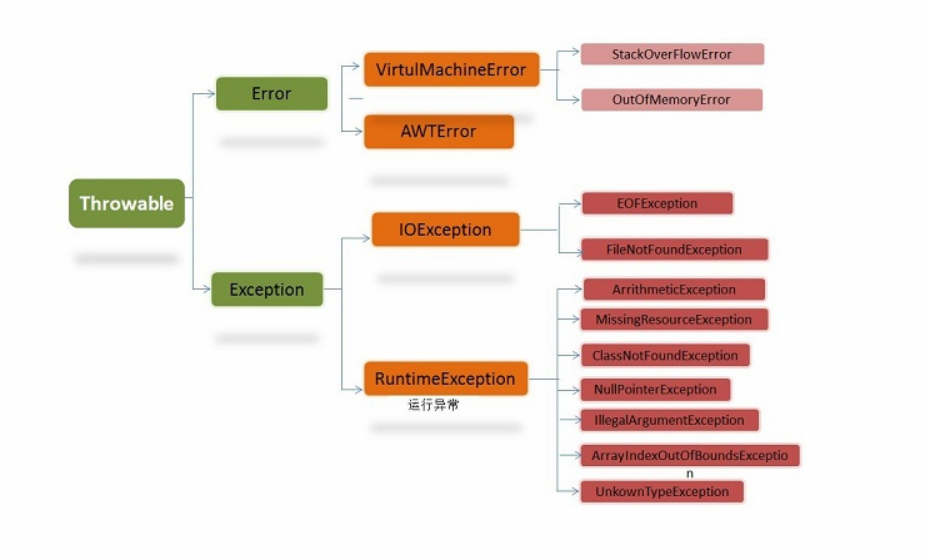

##### Java异常



###### Throwable

有两个重要的子类：Exception(异常)和Error(错误)

###### Error(错误)

是程序无法处理的错误，表示运行应用程序中较严重问题。大多数错误与代码编写者执行的操作无关，而表示代码运行时 JVM（Java 虚拟机）出现的问题。eg:JVM错误

###### Exception(异常)

是程序本身可以处理的异常。
Exception 类有一个重要的子类 RuntimeException。RuntimeException 类及其子类表示“JVM 常用操作”引发的错误。 如：NullPointerException、ArithmeticException、ArrayIndexOutOfBoundException
**注：异常和错误的区别：异常能被程序本身处理，错误是无法处理的** 

###### 运行时异常

都是RuntimeException类及其子类。如NullPointerException(空指针异常)、IndexOutOfBoundsException(下标越界异常)等，这些异常是不检查异常，程序中可以选择捕获处理，也可以不处理 
运行时异常的特点是Java编译器不会检查它，也就是说，当程序中可能出现这类异常，即使没有用try-catch语句捕获它，也没有用throws子句声明抛出它，也会编译通过。 

###### 非运行时异常

是RuntimeException以外的异常，类型上都属于Exception类及其子类。从程序语法角度讲是必须进行处理的异常，如果不处理，程序就不能编译通过。如IOException、SQLException等以及用户自定义的Exception异常，一般情况下不自定义检查异常 

##### 可检查异常**（checked exceptions）** 

定义：编译器要求必须处置的异常
除了RuntimeException及其子类以外，其他的Exception类及其子类都属于可查异常。这种异常的特点是Java编译器会检查它，也就是说，当程序中可能出现这类异常，要么用try-catch语句捕获它，要么用throws子句声明抛出它，否则编译不会通过 

##### 不可检查异常**（unchecked exceptions）** 

定义：编译器不要求强制处理的异常
包括运行时异常（RuntimeException与其子类）和错误（Error）

##### 异常处理机制

###### 抛出异常

当方法出现错误引发异常时，方法创建异常对象并交付运行时的系统，异常对象包含了异常类型和异常出现时的程序状态等异常信息。运行时系统负责寻找处置异常的代码并执行。

###### 捕获异常

方法抛出异常后，运行时系统将寻找合适的异常处理器。潜在异常处理器是异常发生时依次留存在调用栈中的方法集合。从异常方法开始，寻找调用栈中的异常处理器，找到则执行;未找到，则程序终止。
**对于运行时异常、错误或可查异常，Java技术所要求的异常处理方式有所不同**

- 运行时异常：有Java运行时系统自动抛出，允许程序忽略运行时异常
- 错误：当运行时方法不行捕获时，系统允许忽略
- 可检查异常：方法必须捕获，或者声明使其抛出方法之外。意味着，当一个方法选择不捕获可查异常时，必须声明将抛出异常。

###### 捕获方法

- try-catch语句
- try-catch-finally
  finally块：无论是否捕获异常，finally块中的语句都会被执行，当在try或者catch块中有return时，finally块在方法返回之前执行。
  finally块不执行的特殊情况：
  1. 在finally块中发生了异常
  2. 在前面的代码中使用了System.exit()方法退出程序
  3. 程序所在的线程死亡
  4. 关闭CPU

###### 抛出异常

1. throws异常
   如果一个方法可能会出现异常，但没有能力处理这种异常，可以在方法声明处用throws子句来声明抛出异常。

   ```java
   methodname throws Exception1,Exception2,Exception3,...,ExceptionN{
       
   }
   ```

2. Throws抛出异常的规则

   - 如果是不可查异常（unchecked exception），即Error、RuntimeException或它们的子类，可以不使用throws关键字来声明要抛出的异常，编译仍能顺利通过，在运行时会被系统抛出。 
   - 必须声明方法的可抛出的任何可查异常（checked exception）。即如果一个方法可能出现可查异常，要么用try-catch语句捕获，要么用throws子句声明将它抛出，否则会导致编译错误 
   - 只用抛出了异常，该方法的调用者才必须处理或者重新抛出该异常。当方法的调用者无力处理该异常的时候，应该继续抛出。 
   - 调用方法必须遵循任何可查异常的处理和声明规则。若覆盖一个方法，则不能声明与覆盖方法不同的异常。声明的任何异常必须是被覆盖方法所声明异常的同类或子类。 

3. 使用throw抛出异常
   使用位置：函数体内部
   使用方式：异常都是异常类的实例对象，我们可以创建异常类的实例对象通过throw语句抛出。如：`throw new IOExcepton()`。
   如果所有方法都是层层向上抛出获取的异常，最终或由JVM来处理这些异常，直接打印这些异常消息和堆栈消息，如果抛出的是Error或RuntimeException，则方法的调用者可选择处理该异常。

##### Java常见的异常

- RuntimeException子类
  java.lang.NullPointerException:空指针异常
  java.lang.NegativeArraySizeException  数组长度为负异常 
  java.lang.ArrayStoreException 数组中包含不兼容的值抛出的异常 

- IOException
  IOException：操作输入流和输出流时可能出现的异常。
  EOFException   文件已结束异常
  FileNotFoundException   文件未找到异常

- 其他异常和自定义异常SQLException   操作数据库异常类

  NoSuchFieldException   字段未找到异常

  NoSuchMethodException   方法未找到抛出的异常

  NumberFormatException    字符串转换为数字抛出的异常

