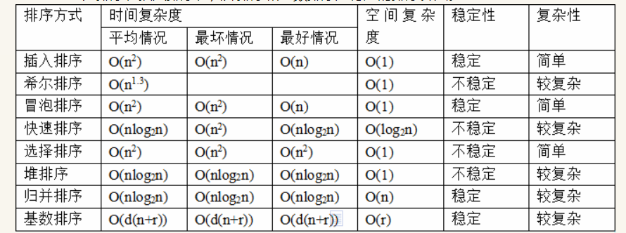

### 排序算法的时间复杂度



### 稳定与非稳定排序算法

定义：能保证排序前，两个相等的元素在序列中的前后位置顺序和排序后他们两在序列中的前后顺序相同  
稳定的排序算法：冒泡排序、插入排序、归并排序，基排序    
不稳定的排序算法：选择排序、快速排序、希尔排序、堆排序

### 排序算法具体实现

#### 快速排序

参考链接：

1. https://blog.csdn.net/IT_ZJYANG/article/details/53406764

```java
public class QuickSort {

    private static void sort(int[] arr, int start, int end) {
        if (start > end) {
            return;
        }
        int partition = divide(arr, start, end);
        //递归
        sort(arr, start, partition - 1);
        sort(arr, partition + 1, end);
    }

    private static int divide(int[] arr, int start, int end) {
        int base = arr[end];
        while (start < end) {
            //从左向右找到比base大的元素
            while (start < end && arr[start] < base) {
                start++;
            }
            //交换
            if (start < end) {
                swap(arr, start, end);
                end--;
            }
            //从右边开始找到比base小的元素
            while (start < end && arr[end] > base) {
                end--;
            }
            //替换
            if (start < end) {
                swap(arr, start, end);
                start++;
            }
        }
        return end;
    }

    private static void swap(int[] arr, int start, int end) {
        int temp = arr[end];
        arr[end] = arr[start];
        arr[start] = temp;
    }

    public static void main(String[] args) {
        int[] a = new int[]{2, 7, 4, 5, 10, 1, 9, 3, 8, 6};
        int[] b = new int[]{1, 2, 3, 4, 5, 6, 7, 8, 9, 10};
        int[] c = new int[]{10, 9, 8, 7, 6, 5, 4, 3, 2, 1};
        int[] d = new int[]{1, 10, 2, 9, 3, 2, 4, 7, 5, 6};

        sort(c, 0, c.length - 1);

        System.out.println("排序后的结果：");
        for (int x : c) {
            System.out.println(x + "");
        }
    }
}

```


#### 插入排序

参考链接：

1. https://www.cnblogs.com/kkun/archive/2011/11/23/2260265.html

```java
public class insertSort {
    //插入排序
    private static void sort(int arr[]) {
        //从第二个元素开始进行比较，左边为已排序好的元素，右边为待排序元素
        for (int i = 1; i < arr.length; i++) {
            //若待排序元素小于左边最后一个元素，则向后一一移动元素比较
            //若待排序元素大于左边最后一个元素，则无需操作，直接进行下一个待排序元素
            if (arr[i - 1] > arr[i]) {
                //存储待排序元素
                int temp = arr[i];
                //这是关键，作为该次循环的局部变量
                int k;
                //依次比较，并移动元素
                for (k = i - 1; k >= 0 && arr[k] > temp; k--) {
                    arr[k + 1] = arr[k];
                }
                //找到位置,放最后的元素呢
                arr[k + 1] = temp;
            }
        }
    }

    public static void main(String[] args) {
        int array[] = new int[]{4, 1, 2, 5};
        System.out.println("排序之前：");
        for (int e : array) {
            System.out.print(e + " ");
        }
        sort(array);
        System.out.println("排序之后");
        for (int a : array) {
            System.out.print(a + " ");
        }
    }
}

```


#### 堆排序

参考链接：

1. ### https://www.cnblogs.com/chengxiao/p/6129630.html

```java
public class HeapSort {
    public static void main(String[] args) {
        int[] arr = {1, 2, 3, 4, 5, 6, 7, 8, 9};
        sort(arr);
        System.out.println(Arrays.toString(arr));
    }

    public static void sort(int[] arr) {
        //构建大顶堆
        for (int i = arr.length / 2 - 1; i >= 0; i--) {
            adjustHeap(arr, i, arr.length);
        }

        //交换元素，调整
        for (int k = arr.length - 1; k > 0; k--) {
            swap(arr, 0, k);
            adjustHeap(arr, 0, k);
        }
    }

    private static void swap(int[] arr, int i, int k) {
        int temp = arr[i];
        arr[i] = arr[k];
        arr[k] = temp;
    }

    private static void adjustHeap(int[] arr, int i, int length) {
        //保存当前元素
        int temp = arr[i];

        //从当前节点的左节点开始
        for (int j = 2 * i + 1; j < length; j = j * 2 + 1) {
            //从左向右比较，如果左节点小于右节点，指向右节点
            if (j + 1 < length && arr[j] < arr[j + 1]) {
                j++;
            }
            //从下向上比较，子节点大于父节点，将子节点赋值给父节点（不用交换），i指向子节点位置
            if (arr[j] > temp) {
                arr[i] = arr[j];
                i = j;
            } else {
                break;
            }
        }
        //将temp值放到最终位置
        arr[i] = temp;
    }
}

```


#### 冒泡排序

参考链接：

1. https://www.jianshu.com/p/f31de0e89f7e

```java
public class BubbleSort {
    public static void main(String[] args) {
        int[] a = new int[]{2, 7, 4, 5, 10, 1, 9, 3, 8, 6};
        bubbleSort(a);
        System.out.println("排序后的结果：");
        for (int x : a) {
            System.out.print(x + "");
        }
    }

    private static void bubbleSort(int[] a) {
        if (a == null || a.length == 0) {
            return;
        }
        for (int i = a.length - 1; i > 0; i--) {
            //优化冒泡排序
            boolean flag = false;
            for (int j = 0; j < i; j++) {
                if (a[j] > a[j + 1]) {
                    swap(a, j, j + 1);
                    flag = true;
                }
            }
            if (flag == false) {
                break;
            }
        }
    }

    private static void swap(int[] a, int j, int i) {
        int temp = a[j];
        a[j] = a[j + 1];
        a[j + 1] = temp;
    }
}
```


图的深度遍历（DFS）和广度遍历(BFS)

参考链接：

1. https://blog.csdn.net/oChangWen/article/details/50729993
2. https://segmentfault.com/a/1190000002685939