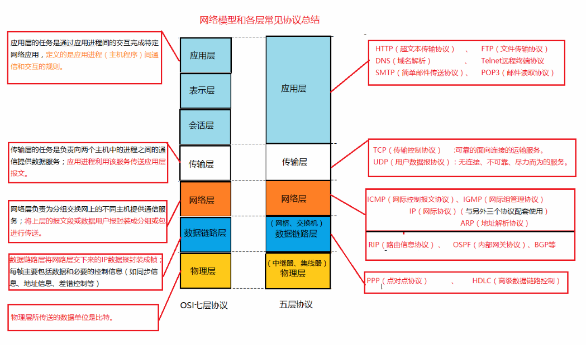

#### OSI七层协议 和 TCP/IP五层协议



#### OSI基本概念

OSI是Open System Interconnect的缩写，意为开放式系统互联。  
OSI七层参考模型的各个层次的划分遵循下列原则：  

1. 同一层中的各网络节点都有相同的层次结构，具有同样的功能。  
2. 同一节点内相邻层之间通过接口（可以是逻辑接口）进行通信。  
3. 七层结构中的每一层使用下一层提供的服务，并且向其上层提供服务。  
4. 不同节点的同等层按照协议实现对等层之间的通信。  

物理层：传输单位是比特（bit）  
数据链路层：传输的单位是帧（frame）,PPP,HDLG  
网络层：传输的数据单位是数据包（packet）,ICMP,IGMP,IP,ARP,RIP,OSPF  
传输层：传输的数据单位是数据报（datagrams）,协议：TCP,UDP  
会话层，表示层没有协议  
应用层：协议：HTTP,FTP等

#### OSI和TCP/IP的区别

TCP/IP协议中的应用层处理开放式系统互联模型中的第五层、第六层和第七层的内容  
TCP/IP协议中的传输层不能总是保证可靠地传输数据包，OSI可以做到。因为，TCP/IP协议中存在UDP传输协议，不稳定，不可靠，尽力而为的传输协议。

#### HTTP和HTTPS

##### HTTPS

**工作原理** ：Https在传输数据的之间需要在客户端和服务器之间进行一次握手，在握手过程中将确定双方加密传输数据的密码信息。  
作用：  
1. 建立了一个信息安全通道  
2. 确认网站的安全性
3. 保证数据的完整性


传输过程中采用**TLS/SSL协议** 使用非对称加密，对称加密和Hash算法。  
握手具体过程:  

1. 客户端将自己支持的一套加密规则发送给服务器  
2. 服务器选出一种加密算法和Hash算法，将自己的身份信息以证书的形式返回给客户端  
   证书中包含了网站地址、加密公钥、以及证书的颁发机构等信息
3. 客户端获得网站证书之后，需要：  
   - 验证证书的合法性
   - 验证通过，客户端生成一串随机数的密码，并用证书中的公钥加密消息
   - 使用约定好的hash算法计算握手消息，使用生成的随机数对消息加密，将之前加密的所有信息发送给服务器
4. 服务器接收到客户端的数据之后：  
   - 使用自己的私钥将信息解密取出密码，使用密码解密浏览器发来的握手消息，并验证hash是否与客户端发来的一致
   - 使用密码加密一段握手消息，发送给客户端
5. 客户端解密并计算握手消息的hash，若和服务器发来的hash一致，此时握手结束。  
   安全传输通道建立，之后的所有通信数据将由之前浏览器生成的随机密码并利用对称加密算法进行加密

###### https发送加密的握手消息的目的

保证双方都获得了一致的密码，并且可以正常的加密解密数据，为后续真正数据的传输做一次测试。

###### HTTPS常用的加密与Hash算法

- 非对称加密算法：RSA,DSA/DSS
- 对称加密算法：AES,RC4,3DES
- HASH算法：MD5,SHA1,SHA256

##### HTTP

常用的网络传输协议，以明文方式发送内容，不提供任何方式的数据加密，若攻击者截取了Web浏览器和网站服务器之间的传输报文，就可以直接获取其中的信息。

##### HTTPS协议和HTTP协议的区别

- https协议需要到ca申请证书
- http是超文本传输协议，信息是明文传输的  
  https是具有安全性的ssl加密传输协议
- http和https使用的是完全不用的链接方式，http使用80端口，https使用443端口
- http是无连接，无状态的
- https协议是由SSL+HTTP协议构建的可进行加密传输，身份认证的网络协议，要比http协议安全。

#### Http的协议格式

```
Http：请求
<request line>:用来说明请求类型、要访问的资源以及使用的HTTP版本。
<headers>：说明服务器要使用的附加信息
<blank line>：空行
<request-body>：任意添加的其他主体（body）
```

#### GET请求和POST请求的区别：

- Get请求是用于信息获取，而且是安全的和幂等的。（安全：不会更改服务器的数据，幂等：同一个URL的多个请求返回同样的结果）  
  Post请求是更新数据，可能改变服务上请求的资源
- 表现形式的不同：  
  Get提交，请求的数据会附在URL的后面  
  Post的提交，数据放在HTTP包的包体中。导致get请求是数据会在地址栏显示出来，而Post则不会
- 安全性：  
  不同于之前的安全性，Post的安全性比Get的安全性要高。get提交数据是用户名和密码基本都是明文表示的。
- G的长度有限制（浏览器限制）  
  P没有
- G请求可以被缓存下来，点击返回或者刷新，没有影响  
  P不能缓存，点击返回或者刷新，数据会重新发送
- G请求，只发送一次http请求  
  P请求，发送两次http请求，一次发送header,一次发送body

#### 响应的状态码

200(OK)：找到了资源，并且一切正常。
304(NOT MODIFIED):改资源在上次请求之后没有任何修改。这通常用于浏览器的缓存机制
401(UNAUTHORIZED)：客户端无权访问该资源。
403(FORBIDDEN)：客户端未能获得授权
404(NOT FOUND)：在指定位置不存在所申请的资源
500(Internal Server Error )：服务器错误

#### HTTP特点

- 支持客户端/服务器模式
- 简单快速
- 灵活
- 无连接：每次只能处理一个请求。服务器处理完客户的请求，并收到客户端的应答后，断开连接。
- 无状态：对于事务处理没有记忆能力，服务器不知道客户端是什么状态。每个请求都是独立的。后来出现了两种记录HTTP连接状态的技术出现：
  Cookie:保存在客户端中，保持登录信息到用户下次与服务器的会话。
  Session:保存在服务器端，通过服务器来保持状态

#### Http的三次握手

原因：为了防止已失效的连接请求报文段突然又传送到了服务端，而产生错误，防止server端一直等待，浪费资源。
待完善……
参考链接：

1.  http://blog.jobbole.com/105633/?utm_source=blog.jobbole.com&utm_medium=relatedPosts
2. https://www.cnblogs.com/ttltry-air/archive/2012/08/20/2647898.html

#### HTML5新特性

[参考链接](https://www.csdn.net/article/2012-02-21/312179)

- 新文档类型
- 脚本和链接无需type
- 语义Header和Footer
- Hgroup子标题
- 标记元素（mark）
- 图形元素，关联文字和图片
- 占位符（Placeholder）
- 必要属性(required Attribute),指定某一个输入是否必需
- audio支持
- Video的支持
- 视频预载
- 显示控制条
- 重新定义<samll>
- Autofocus属性
- pattern属性，让我们可以直接加入正则表达式


链接：

1. https://blog.csdn.net/skyroben/article/details/77073834
2. https://blog.csdn.net/huangjin0507/article/details/51613561

#### 子网掩码的计算

**子网掩码作用**：通过和IP地址的一些运算，可以将某个IP地址划分为网络地址和主机地址两部分。
意义：TCP/IP协议进行两台主机之间的通信时，通过获得网络号，识别出目标主机是在同一网段还是远程主机。
操作：
网络号获取：将IP地址和子网掩码转换成二进制，做“与”运算，即可得到目标主机所在的网络号
主机号获取：将子网掩码取反，然后和IP地址做“与”运算，即可获得主机号。 

缺省子网掩码：

- A类网络缺省子网掩码：255.0.0.0，IP地址的网络地址的最高位是‘0’,范围从0～127 
- B类网络缺省子网掩码：255.255.0.0，IP地址的网络地址的最高位是‘10’,范围从128-191 
- C类网络缺省子网掩码：255.255.255.0,IP地址的网络地址的最高位是“110”,范围从192-223 

计算：

1. 子网数目=2^X         x=子网位数 ()
2. 主机数目=2^y-2      y=主机位数 
3. 广播地址=主机位为全1的地址=下个子网号-1 
4. 子网位数：观察子网掩码的二进制位数，其中全是1的位置减去该类缺省网络的子网掩码中全是1的位数
5. 主机位数：（1）主机数量装换成二进制的位数（2）除去网络地址的位数

