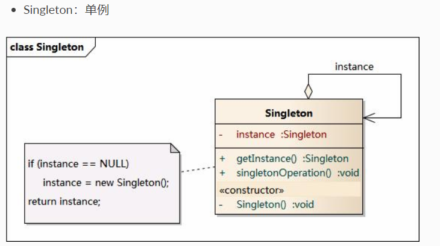
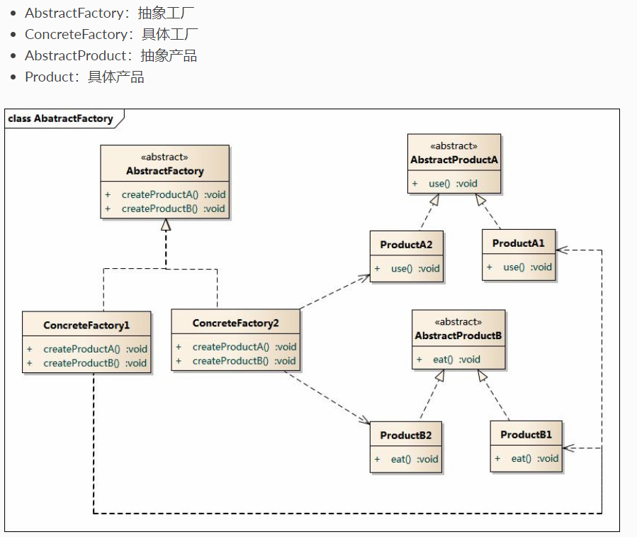
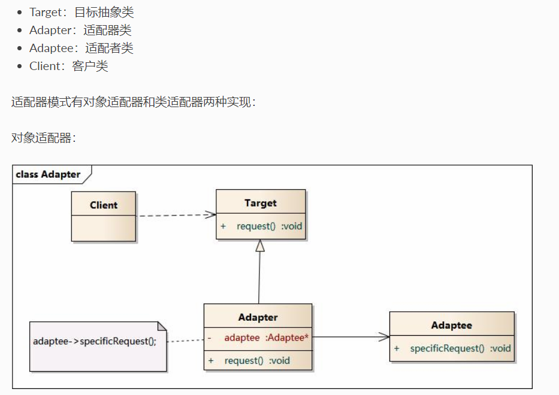
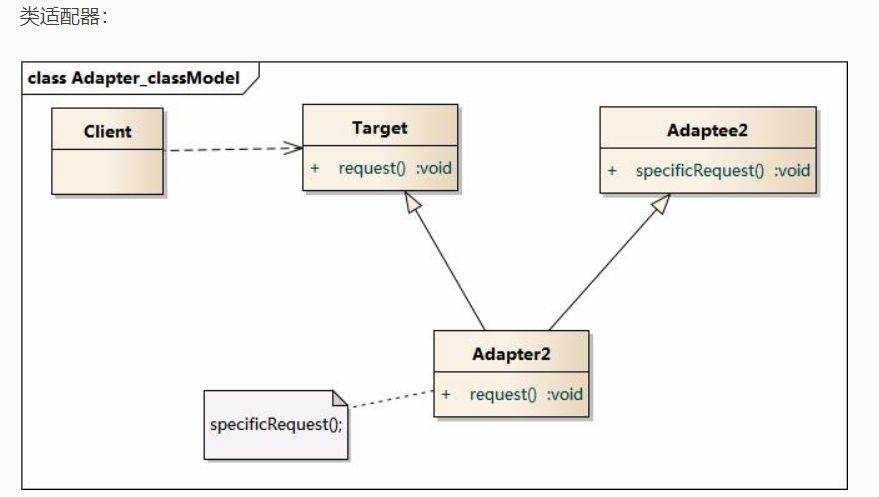
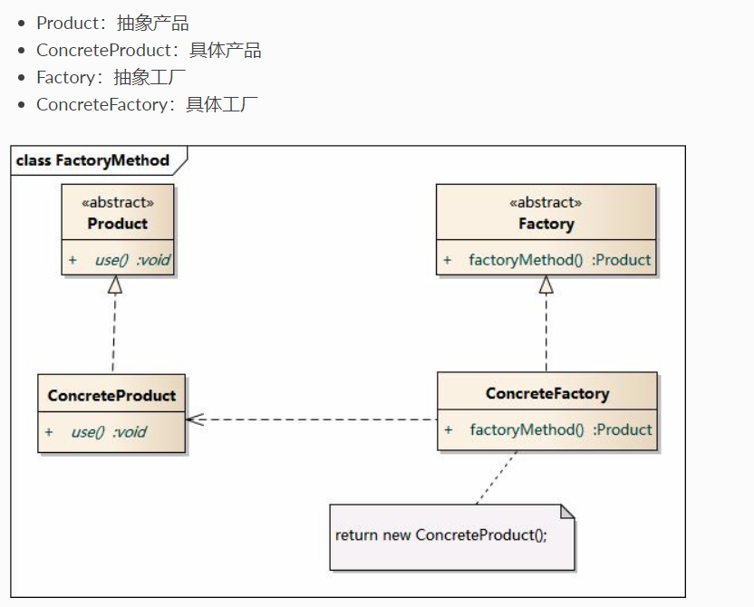
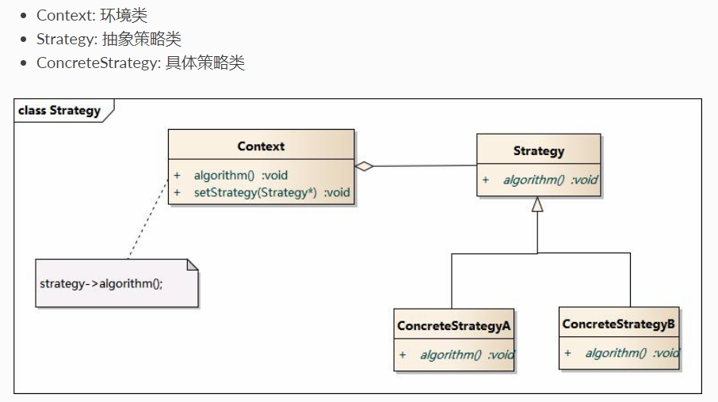

**设计模式** ：是一套被反复使用，多数人知晓的，经过分类编目的代码设计经验的总结
[参考这里](https://github.com/youlookwhat/DesignPattern)

#### 单例模式

确保一个类只有一个实例，并提供一个全局访问点  

### 抽象工厂

提供一个接口，用于创建相关或依赖对象的家族，而不需要指定具体实现类   

### 适配器

将一个类的接口，转换成客户期望的另一个类的接口。让原本接口不兼容的类，相互合作。  
对象适配器  

类适配器  

### 工厂方法模式

定义一个创建对象的接口，由子类决定实例化的类是哪一个，把类的实例化推迟到子类  

### 策略模式

定义了一个算法簇，分别封装起来，让他们之间可以相互替换，让算法的变化独立于使用算法的客户。  

#### 代理模式

定义：给某个对象提供一个代理对象，并由代理对象控制对于原对象的访问，即客户端不直接操控原对象，而是通过代理对象间接的操控原对象。

1. 静态代理：代理类是在编译时就实现好的，Java编译完成后代理类时一个实际的class文件。
   抽象主题（subject）:声明真实对象和代理对象的共同接口
   代理（Proxy）：代理对象内部含有对真实对象的引用，从而可以操作真实对象，同时代理对象提供与真实对象相同的接口以便在任何时候都能替代真实对象。代理对象可以再执行真实对象操作时，附加其他的操作，相当于对真实对象进行封装。
   真实对象（RealSubject）:代理角色所代表的真实对象，是我们最终要引用的对象。
2. 动态代理：代理类在运行的时候生成。同时解决多个代理类的问题，不需要为每个类单独创建一个代理对象。
   原理：主要利用了Java的反射机制
   实现：首先实现一个InvocationHandler接口，然后通过使用Proxy.newProxyInstance()方法来动态的创建一个代理。

#### 工厂模式

#### 适配器模式

